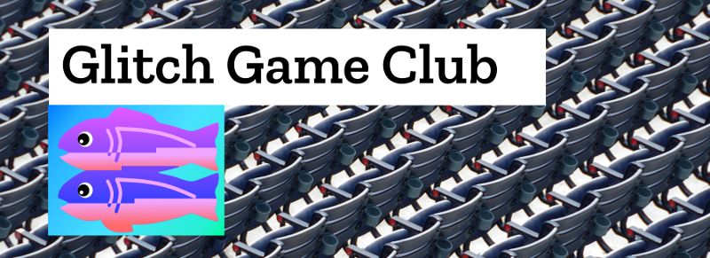

# Welcome to the Glitch Game Making Club Resource 

Welcome to the Glitch Gamemakers Resource. Many thanks for taking the time to look at our project. We hope this is a useful space and thank you in advance for any contribution you can make. We are not sponsored by Glitch.com we just love the tool as a place for our learners to have fun and learn things. 

This project aims to be a network of people to support computer club activities to make games. Together we will create a hub of resources to help this happen. Our particular focus will be on;
[Creating audio, visual and story assets](https://github.com/mickfuzz/mozilla_html5_game_clubs/wiki#creating-game-assets) for video games using free and open tools, [Coding web-based games in Javascript](https://github.com/webgameclubs/edlab-gamemakers-club#example-web-games-in-glitch) using Phaser.js, [Fun activities inspiring a creative response to local and global issues (especially “writing / coding in-role”)](http://write.flossmanuals.net/learn-javascript-with-phaser/)

### Remixable Phaser Web Games in Glitch

We are actively seeking simple 'boilerplate'/ starter games in [Glitch](https://glitch.com/) to add to this list. Ideally these games will be half-baked in some way. By this we mean games that invite users to dive into the code by hitting remix and fix them or improve them in some way. 

See below for details on how to contribute. 

* [Grid Platform Game](https://grid-game-template.glitch.me/)
* [2d Breakout Game by end3r](https://2d-breakout-end3r.glitch.me/)

We will help learners to be choose their own paths, work collaboratively and be inspired to make fun games with positive messages.

##  Getting involved in the Clubs and our Resource

Please join us to support the Game Making Club Process and the Resources we are creating. 

Can you help us in one of the following ways to get involved?

* [**Game and Resource Creators:**](https://github.com/mickfuzz/mozilla_html5_game_clubs/blob/master/CONTRIBUTING.md#what-were-working-on-right-now) to help build a library of remixable HTML5 games and linked resources. [Glitch](https://glitch.com/) and Phaser 2 are the tools we use. Please have a look at [How to contribute](https://github.com/mickfuzz/mozilla_html5_game_clubs/blob/master/CONTRIBUTING.md#what-were-working-on-right-now) and our [coding games guidelines](https://github.com/webgameclubs/edlab-gamemakers-club/blob/master/CODE_GUIDE.md)
* [**Web Coding Mentors:**](https://github.com/mickfuzz/mozilla_html5_game_clubs/issues) you will be a subject enthusiast from one of the area of activity. You volunteer for either video chats, to give feedback on projects or to answer forum questions. [Please sign up here by creating an issue](https://github.com/mickfuzz/mozilla_html5_game_clubs/issues/new)

Please see [CONTRIBUTING.md](CONTRIBUTING.md) for more information on all of the above.

## Communication and Publication Channels 

Please take time to review our [code of conduct](CODE_OF_CONDUCT.md) aimed at young people, families and other contriubtors. 

You can view some of our activity  at the following locations:

* [Our Project Blog](https://digitalducks.org/glitch-game-club/)
* Follow Discussions [on our Issues page](https://github.com/mickfuzz/mozilla_html5_game_clubs/issues)
* [Our Wiki for Resources sharing](https://github.com/mickfuzz/mozilla_html5_game_clubs/wiki)
* [If you get stuck Coding please ask questions here](https://github.com/glitch-game-club/glitch-game-club/issues/54)
