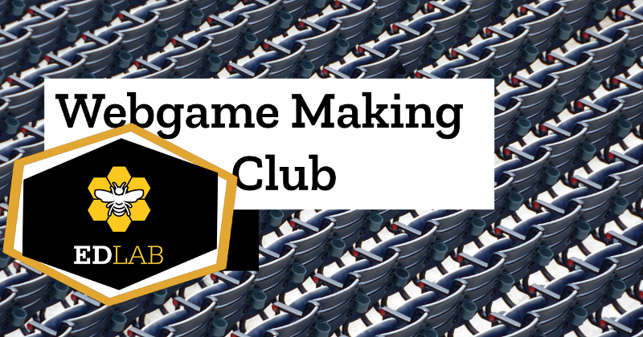

# Welcome to the EdLab Game Making Club Resource 

Welcome to the EdLab Game Club Resource. Many thanks for taking the time to look at our project. We hope this is a useful space and thank you in advance for any contribution you can make.

This project aims to be a network of people to support computer club activities to make games. Together we will create a hub of resources to help this happen. Our particular focus will be on;
[Creating audio, visual and story assets](https://github.com/mickfuzz/mozilla_html5_game_clubs/wiki#creating-game-assets) for video games using free and open tools, [Coding web-based games in Javascript](https://github.com/webgameclubs/edlab-gamemakers-club#example-web-games-in-glitch) using Phaser.js, [Fun activities inspiring a creative response to local and global issues (especially “writing / coding in-role”)](http://write.flossmanuals.net/learn-javascript-with-phaser/)

### Remixable Web Games in Glitch

We are actively seeking simple 'boilerplate' games in [Glitch](https://glitch.com/) to add to this list. See below for details on how to contribute. 

* [Simple Game Created to Be Edited](https://webgameclubs-simple-game-to-edit.glitch.me/)
* [2d Breakout Game by end3r](https://vivid-typhoon.glitch.me/)
* (Using old Thimble system) [Phaser Platform Game Tutorial from Richard and Alvin](https://thimbleprojects.org/piratepete/334344/)
* (Using old Thimble system)  [Intentionally Rubbish Phaser Platform for workshops](https://thimbleprojects.org/davegoopot/417060/)

We will help learners to be choose their own paths, work collaboratively and be inspired to make fun games with positive messages.

##  Getting involved in the Clubs and our Resource

Please join us to support the Game Making Club Process and the Resources we are creating. 

Can you help us in one of the following ways to get involved?

* [**Game and Resource Creators:**](https://github.com/mickfuzz/mozilla_html5_game_clubs/blob/master/CONTRIBUTING.md#what-were-working-on-right-now) to help build a library of remixable HTML5 games and linked resources. Thimble and Phaser.io are our go-to tools. [Please sign up here by creating an issue](https://github.com/mickfuzz/mozilla_html5_game_clubs/issues/new)
* [**Web Coding Mentors:**](https://github.com/mickfuzz/mozilla_html5_game_clubs/issues) you will be a subject enthusiast from one of the area of activity. You volunteer for either video chats, to give feedback on projects or to answer forum questions. [Please sign up here by creating an issue](https://github.com/mickfuzz/mozilla_html5_game_clubs/issues/new)

Please see [CONTRIBUTING.md](CONTRIBUTING.md) for more information

## Communication and Publication Channels 

Please take time to review our [code of conduct](CODE_OF_CONDUCT.md) aimed at young people, families and other contriubtors. 

You can view some of our activity  at the following locations:

* [Our Project Blog](https://digitalducks.org/webgames-club/)
* Follow Discussions [on our Issues page](https://github.com/mickfuzz/mozilla_html5_game_clubs/issues)
* [Volunteer for a role](#getting-involved-in-the-clubs-and-our-resource) 
* [Our Wiki for Resources sharing](https://github.com/mickfuzz/mozilla_html5_game_clubs/wiki)
* [Invite Google Group for our current Manchester Club cohort](https://groups.google.com/forum/#!forum/mozilla-html5-gamemaking-mcr)
* [If you get stuck Coding please ask questions here](https://discourse.mozilla.org/t/learning-web-development-marking-guides-and-questions/16294)
